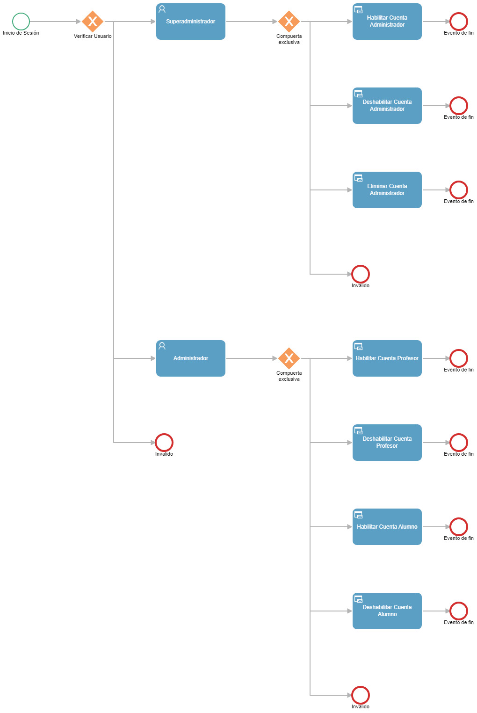


**Documento de Negocio**
**

		**Proyecto EvaEduca: Plataforma educativa con asistente virtual y autoevaluación AI** 

**Versión 1.1**

**Historial de Revisiones**

|**Fecha**|**Versión**|**Descripción**|**Autor**|
| - | - | - | - |
|11/04/2024|1\.0|Versión preliminar como una propuesta de desarrollo.|Álvaro Andrés Chávez Ccahuana|
|06/05/2024|1\.1|Reestructura del documento de negocio.|Equipo|
|||||
|||||
|||||
|||||
|||||

**Tabla de Contenidos**

[1. Introducción](#_heading=h.1fob9te)

[1.1 Propósito](#_heading=h.x8dev0qcgdzp)

[1.2 Glosario](#_heading=h.3gbxxmgeo82g)

[2. Proceso: Registro y autenticación de usuarios](#_heading=h.czqsb0p06nok)

[2.1 Ficha del proceso](#_heading=h.462wlwli3mrs)

[2.2 Diagrama del proceso](#_heading=h.rnba47n08o46)

[2.3 Descripción de actividades](#_heading=h.r1m4usbjqcpl)

[4. Proceso: Gestión de Cuentas de Usuario.](#_heading=h.kfcda8hp97gl)

[4.1 Ficha de Proceso](#_heading=h.xaqw1xosv3l)

[4.2 Diagrama del Proceso](#_heading=h.n30edv4xm67l)

[4.3 Descripción de Actividades](#_heading=h.a7vbej849lv3)

[5. Proceso: Gestión de cursos](#_heading=h.ruoqy95jo1q)

[5.1 Ficha de proceso](#_heading=h.4fmbwj4mif64)

[5.2 Diagrama de proceso](#_heading=h.cjonv4ez0g7v)

[5.3 Descripción de actividades](#_heading=h.65ndex57hend)

[6. Proceso: Gestión de Evaluación](#_heading=h.xi9ef7x2o3mu)

[6.1 Ficha de Proceso](#_heading=h.17dp8vu)

[6.2 Diagrama de Proceso](#_heading=h.2tt6jnn1x71j)

[6.3 Descripción de actividades](#_heading=h.6k5tqn2cu3a2)

[7. Proceso: Respuesta a reclamos:](#_heading=h.ksxassmnjlla)

[7.1 Ficha de proceso:](#_heading=h.3531m1vr6rkg)

[7.2 Diagrama de proceso:](#_heading=h.8a97h5on4g6o)

[7.3 Descripción de actividades:](#_heading=h.al7dmvn8tlpx)

**Documento de Negocio**
1. **Introducción**

En un mundo donde la educación está en constante evolución y enfrenta nuevos desafíos, el proyecto Eva Educa surge como una solución que busca mejorar la eficiencia y la calidad del proceso de evaluación educativa.

Eva Educa tiene como objetivo principal mejorar la experiencia tanto de docentes como de estudiantes al agilizar el proceso de revisión y retroalimentación de las evaluaciones. Al integrar un asistente virtual y autoevaluación basada en IA, la plataforma permite a los profesores ingresar rúbricas de evaluación y generar autoevaluaciones de manera automatizada, proporcionando una evaluación más rápida, precisa y personalizada para los estudiantes.

A lo largo de este documento, explicaremos en detalle la visión, los objetivos y la estrategia de implementación de Eva Educa, así como su modelo de negocio y el potencial impacto que puede tener en el panorama educativo.

1.1. **Propósito**
   
El propósito del proyecto es mejorar la eficiencia en el proceso de evaluación educativa al integrar tecnología de inteligencia artificial para ayudar a los docentes en la revisión de exámenes y la evaluación de desempeño de los estudiantes. Esto se lograría mediante la creación de una plataforma educativa que permita el ingreso de rúbricas de evaluación por parte del profesor y la generación de autoevaluaciones por parte de un asistente virtual implementado con IA. El objetivo final sería agilizar el proceso de evaluación, proporcionar retroalimentación automática a los estudiantes y permitirles revisar sus calificaciones de manera rápida y precisa.

1.2. **Glosario**

### 2. Proceso: Registro y Autenticación de Usuarios

#### 2.1 Ficha de Proceso

| **ID** | **Actividad**           | **Datos de Entrada**            | **Datos de Salida**              |
| :-:    | :-:                     | :-:                             | :-:                              |
| 1      | Registro de usuario     | Datos personales del usuario    | Confirmación de registro         |
| 2      | Validación de correo    | Dirección de correo del usuario | Código de validación             |
| 3      | Activación de cuenta    | Código de validación            | Confirmación de activación       |
| 4      | Inicio de sesión        | Credenciales del usuario        | Confirmación de inicio de sesión |
| 5      | Verificación de rol     | Identificador del usuario       | Información de Rol               |
| 6      | Recuperación de cuenta  | Correo electrónico del usuario  | Código de recuperación           |
| 7      | Cambio de contraseña    | Código de recuperación, nueva contraseña | Confirmación de cambio de contraseña |

#### 2.2 Diagrama del Proceso

#### 2.3 Descripción de Actividades

| **ID** | **Actividad**           | **Descripción**                                                                                   | **Rol**                                | **Tipo**   |
| :-:    | :-:                     | :-:                                                                                               | :-:                                    | :-:        |
| 1      | Registro de usuario     | El usuario proporciona sus datos personales para crear una cuenta nueva en la plataforma.        | Usuario, Sistema                       | Manual     |
| 2      | Validación de correo    | El sistema envía un código de validación al correo electrónico del usuario para verificar su identidad. | Sistema                               | Automático |
| 3      | Activación de cuenta    | El usuario ingresa el código de validación recibido para activar su cuenta.                      | Usuario, Sistema                       | Manual     |
| 4      | Inicio de sesión        | El usuario ingresa sus credenciales (nombre de usuario y contraseña) para acceder a la plataforma.| Usuario, Sistema                       | Manual     |
| 5      | Verificación de rol     | El sistema verifica el rol del usuario (administrador, profesor, alumno) para habilitar las opciones correspondientes. | Sistema                               | Automático |
| 6      | Recuperación de cuenta  | El usuario solicita un código de recuperación de cuenta que es enviado a su correo electrónico.  | Usuario, Sistema                       | Manual     |
| 7      | Cambio de contraseña    | El usuario utiliza el código de recuperación para establecer una nueva contraseña.               | Usuario, Sistema                       | Manual     |

4. **Proceso: Gestión de Cuentas de Usuario**

   4.1. **Ficha de Proceso**

|**ID**|**Actividad**|**Datos de Entrada**|**Datos de Salida**|
| :-: | :-: | :-: | :-: |
|1|Inicio de sesión|Credenciales del usuario|Confirmación de inicio de sesión|
|2|Verificar rol|Identificador del usuario|Información de Rol|
|3|
Habilitar

administrador
|Selección de opción para habilitar|Confirmación de habilitación|
|4|
Deshabilitar

administrador
|Selección de opción para deshabilitar|Confirmación de deshabilitación|
|5|Eliminar administrador|Selección de opción para eliminar |Confirmación de eliminación|
|6|
Habilitar

profesor
|Selección de opción para habilitar|Confirmación de habilitación|
|7|
Deshabilitar

profesor
|Selección de opción para deshabilitar|Confirmación de deshabilitación|
|8|Eliminar profesor|Selección de opción para eliminar |Confirmación de eliminación|
|9|
Habilitar

alumno
|Selección de opción para habilitar|Confirmación de habilitación|
|10|
Deshabilitar

alumno
|Selección de opción para deshabilitar|Confirmación de deshabilitación|
|11|Eliminar alumno|Selección de opción para eliminar |Confirmación de eliminación|

   4.2. **Diagrama del Proceso**

     

   4.3. **Descripción de Actividades**

|**ID**|**Actividad**|**Descripción** |**Rol**|**Tipo**|
| :-: | :-: | :-: | :-: | :-: |
|1|Inicio de sesión|El usuario inicia sesión en la plataforma.|Usuario|Manual|
|2|Verificar rol|Se verifica si tiene rol de superadministrador o administrador.|Sistema|Manual|
|3|
Habilitar

administrador
|
De confirmarse el rol de superadministrador se le habilita la opción de Habilitar

administrador.
|Superadministrador|Manual|
|4|
Deshabilitar

administrador
|
De confirmarse el rol de superadministrador se le habilita la opción de Deshabilitar

administrador.
|Superadministrador|Manual|
|5|Eliminar administrador|De confirmarse el rol de superadministrador se le habilita la opción de Eliminar administrador.|Superadministrador|Manual|
|6|
Habilitar

profesor
|De confirmarse el rol de superadministrador o administrador se le habilita la opción de Habilitar profesor.|Administrador|Manual|
|7|
Deshabilitar

profesor
|De confirmarse el rol de superadministrador o administrador se le habilita la opción de Deshabilitar profesor.|Administrador|Manual|
|8|Eliminar profesor|De confirmarse el rol de superadministrador o administrador se le habilita la opción de Eliminar profesor.|Administrador|Manual|
|9|
Habilitar

alumno
|De confirmarse el rol de superadministrador o administrador se le habilita la opción de Habilitar alumno.|Administrador|Manual|
|10|
Deshabilitar

alumno
|De confirmarse el rol de superadministrador o administrador se le habilita la opción de Deshabilitar alumno.|Administrador|Manual|
|11|Eliminar alumno|De confirmarse el rol de superadministrador o administrador se le habilita la opción de Eliminar alumno.|Administrador|Manual|

5. **Proceso: Gestión de cursos**

   5.1. **Ficha de proceso**

|
**Número o código** 

**de proceso**
|**Proceso**|**Responsable**|**Objetivo / Propósito**|
| :-: | :-: | :-: | :-: |
|PROC-004|Gestión de cursos|Jefe de Proyecto|Optimizar la gestión de cursos y subida de exámenes.|

-

|**Identificador**|**Actividad**|**Datos de Entrada**|**Datos de Salida**|
| :-: | :-: | :-: | :-: |
|1|Creación de curso|Nombre del curso, descripción del curso, profesor asignado|Confirmación de creación del curso, detalles del curso creado|
|2|Asignación de Profesor a Curso|Curso a asignar, identificación del profesor|Confirmación de asignación del profesor, detalles actualizados del curso|
|3|Inscripción de Alumnos en Curso|Curso en el que se inscriben los alumnos, datos de los alumnos (nombre, identificación, contacto)|Confirmación de inscripción de alumnos, listado de alumnos inscritos|
|4|Actualización de Curso|Curso a actualizar, nueva información del curso (contenido, fechas, etc.)|Confirmación de actualización del curso, detalles actualizados del curso|
|5|Eliminación de Curso|Curso a eliminar|Confirmación de eliminación del curso|
|6|Visualización de Cursos|Identificación del profesor/alumno|Listado de cursos inscritos/asignados|
|7|Administración de Contenido del Curso|Curso a administrar (Gestión de tareas, exámenes y rúbricas)|Confirmación de subida de materiales, contenidos y materiales del curso disponibles para alumnos|

   5.2. **Diagrama de proceso**

  

   5.3. **Descripción de actividades**

|**ID**|**Actividad**|**Descripción** |**Rol**|**Tipo**|
| :-: | :-: | :-: | :-: | :-: |
|1|Creación de curso|El profesor crea un nuevo curso proporcionando los detalles necesarios como el nombre del curso, descripción, y profesor asignado.|Profesor|Manual|
|2|Asignación de Profesor a Curso|El administrador asigna un profesor al curso recién creado o existente.|Profesor|Manual|
|3|Inscripción de Alumnos en Curso|Los alumnos se inscriben en el curso mediante la aplicación.|Alumno|Manual|
|4|Actualización de Curso|El profesor actualiza la información del curso, como el contenido del curso, fechas importantes, y otros detalles.|Profesor|Manual|
|5|Eliminación de Curso|El profesor elimina un curso existente cuando ya no es necesario.|Profesor|Manual|
|6|Visualización de Cursos|El profesor y los alumnos pueden visualizar los cursos en los que están inscritos.|Profesor y alumno|Automático|
|7|Administración de Contenido del Curso|El profesor administra el contenido del curso, asignando tareas y actualizando recursos.|Profesor|Manual|

6. **Proceso: Gestión de Evaluación**

   6.3. **Ficha de Proceso**

   6.4. **Diagrama de Proceso**

   6.5. **Descripción de actividades**

7. **Proceso: Respuesta a reclamos:**

   7.1. **Ficha de proceso:**

|
**Número o código** 

**de proceso**
|**Proceso**|**Responsable**|**Objetivo / Propósito**|
| :-: | :-: | :-: | :-: |
|PROC-006|Respuesta a reclamos|Jefe de Proyecto|Proporcionar un servicio de respuesta eficiente y eficaz tanto para el docente como para el alumno.|

|**ID**|**Actividad**|**Datos de Entrada**|**Datos de Salida**|
| :-: | :-: | :-: | :-: |
|1|Recepción del reclamo|Reclamo del alumno, con detalles sobre qué está reclamando.|Confirmación de recepción del reclamo y registro en el sistema.|
|2|Registro de reclamo|Reclamo del alumno junto con cualquier información adicional proporcionada por el profesor.|Registro del reclamo en el sistema, incluye: ID del reclamo, fecha de recepción, descripción del problema.|
|3|Revisión del reclamo|Detalles del reclamo: Evaluación en cuestión, calificación inicial, cualquier otra explicación del alumno.|Análisis de la situación por parte del profesor, |
|4|Corrección o sustentación de la evaluación|Evaluación en cuestión, criterios de evaluación, reclamo del alumno y cualquier evidencia adicional proporcionada.|Corrección de la evaluación, explicación detallada de la calificación otorgada o cualquier ajuste realizado en la calificación original.|
|5|Comunicación con el alumno|Respuesta del profesor al reclamo, que incluye cualquier explicación o corrección realizada en la evaluación.|Comunicación al alumno sobre la respuesta al reclamo, que puede incluir detalles sobre cualquier acción tomada y los próximos pasos a seguir.|
|6|Registro de la respuesta|Respuesta al reclamo junto con cualquier acción tomada.|Registro de la respuesta en el sistema, que incluye detalles como la fecha y la descripción de la acción tomada.|
|7|Seguimiento del reclamo|Estado actual del reclamo y cualquier actualización relevante.|Registro actualizado del estado del reclamo, que puede incluir notas adicionales sobre el seguimiento realizado.|

   7.2. **Diagrama de proceso:**

   

   7.3. **Descripción de actividades:**

|**ID**|**Actividad**|**Descripción**|**Rol**|**Tipo**|
| :-: | :-: | :-: | :-: | :-: |
|1|Recepción del reclamo|Recepción del reclamo por parte del alumno y registro en el sistema.|
DBA,

Jefe de proyecto
|Manual|
|2|Registro de reclamo|Registro detallado del reclamo en el sistema, asignándole un identificador único.|
DBA,

Jefe de proyecto
|Manual|
|3|Revisión del reclamo|Revisión exhaustiva del reclamo por parte del equipo de soporte, analizando la evaluación y la calificación.|
Analista funcional,

Tester
|Manual|
|4|Corrección o sustentación de la evaluación|Corrección de la evaluación si es necesario, o sustentación de la calificación original.|
Analista funcional,

Tester
|Manual|
|5|Comunicación con el alumno|Comunicación de la respuesta al reclamo al alumno, proporcionando detalles y explicaciones.|
Analista funcional,

Jefe de proyecto
|Manual|
|6|Registro de la respuesta|Registro de la respuesta al reclamo en el sistema, documentando las acciones tomadas.|
DBA,

Jefe de proyecto,

Tester
|Manual|
|7|Seguimiento del reclamo|Seguimiento continuo del reclamo para garantizar su resolución satisfactoria.|Desarrollador Backend|Manual|

